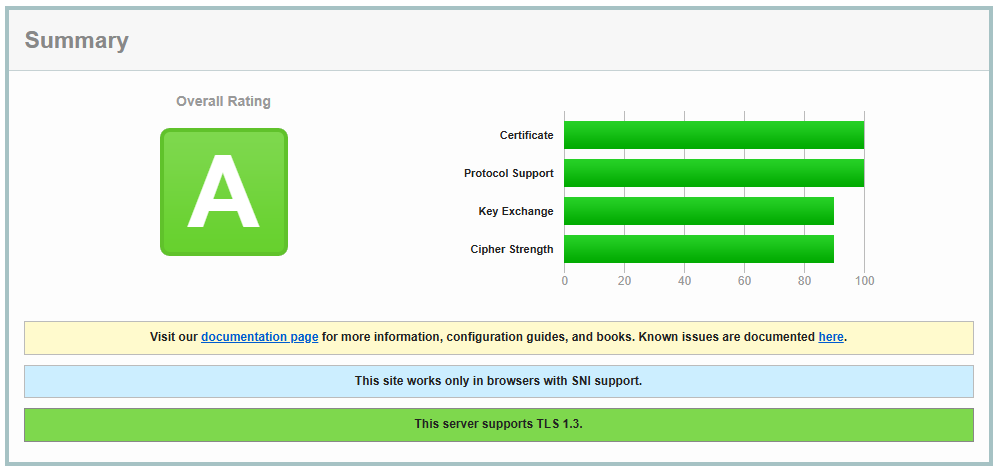

# Guide: Setting Up a Kubernetes Cluster with K3s, Traefik, cert-manager & Kubernetes Dashboard 

## 📚 Table of Content

- [Introduction](#introduction)
- [K3s Installation](#k3s-install)
  - [Requirements](#requirements)
  - [Installation of the Cluster](#installation)
  - [Kubeconfig](#kubeconfig)
- [Kubernetes Dashboard](#demo)
  - [cert-manager](#demo)
  - [Let's Encrypt](#demo)
  - [Ingress-Controller (with Traefik)](#demo)
  - [Dashboard Access](#demo)
  - [Domain Security Status](#demo)
- [Set-Up Demo Nginx Application](#demo)
- [Summary / Conclusion](#demo)
- [References](#references)


## introduction
In This guide/blog i Will show you how i set up my own kubernetes cluster & dashboard using k3s, Traefik and cert-manager.

In [THIS](https://github.com/d4niee/cluster-services) repo you can also see how you can manage and automate the cluster processes like deployment, update, deleting ressources and more.

first let's start with the used technologies for the cluster:

- **k3s** [1]:
  K3s is a fully compliant Kubernetes distribution with the following enhancements:

  - Distributed as a single binary or minimal container image.
  - Lightweight datastore based on sqlite3 as the default storage backend. etcd3, MySQL, and Postgres are also available.
  - Wrapped in simple launcher that handles a lot of the complexity of TLS and options.
  - Secure by default with reasonable defaults for lightweight environments.
  - Operation of all Kubernetes control plane components is encapsulated in a single binary and process, allowing K3s to automate and manage complex cluster operations like distributing certificates.
  - External dependencies have been minimized; the only requirements are a modern kernel and cgroup mounts.
  - Packages the required dependencies for easy "batteries-included" cluster creation:
    - containerd / cri-dockerd container runtime (CRI)
    - Flannel Container Network Interface (CNI)
    - CoreDNS Cluster DNS
    - Traefik Ingress controller
    - ServiceLB Load-Balancer controller
    - Kube-router Network Policy controller
    - Local-path-provisioner Persistent Volume controller
    - Spegel distributed container image registry mirror
    - Host utilities (iptables, socat, etc)

- **helm**: todo
- **traefik**: todo
- **cert-manager**: todo
- **kubernetes-dashboard**: todo

## k3s install

In this chapter i will show you how you can install the k3s cluster on your maschine. It does not matter if it's a VPS, raspberry pi or VM. You just need to be sure that you have a exposed domain mapped to your IP for your maschine to continue with this tutorial (for example demo.mydomain.com). In My case i set up da VPS with  [contabo.com](https://contabo.com/de/)

### Requirements

before we start follow the Requirements guide from k3s to be sure no issues will appear later. if you are using a ubuntu maschine like me you can allow following ports from your firewall:

```bash
sudo ufw allow 6443/tcp
sudo ufw allow from 10.42.0.0/16 to any
sudo ufw allow from 10.43.0.0/16 to any
```

also be sure that you maschine has at least 4G of RAM, 2 Cores and
enough disk space, but k3s don'T need much space.

### installation

install the k3s cluster with following command:

```
curl -sfL https://get.k3s.io | sh -
```

thats it! that's all we have to do. Not really because we need the Kubeconfig to access our cluster but it's currently running and ready.

### Kubeconfig

You can find the Kubeconfig under the path ``/etc/rancher/k3s/k3s.yaml`` you can view it with the following command:

```bash
cat /etc/rancher/k3s/k3s.yaml
```

you should now see something like that:

```
apiVersion: v1
clusters:
- cluster:
    certificate-authority-data: 
    LS0tL ...
    ...
...
```

be sure to save this kubeconfig to your local maschine or whatever maschine you want to access the cluster.

## Kubernetes Dashboard

### Domain Security Status




## references

[1] Official k3s Documentation: https://docs.k3s.io/