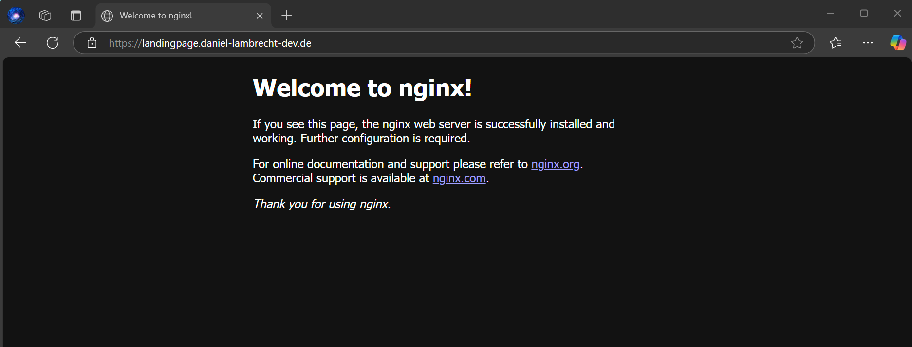
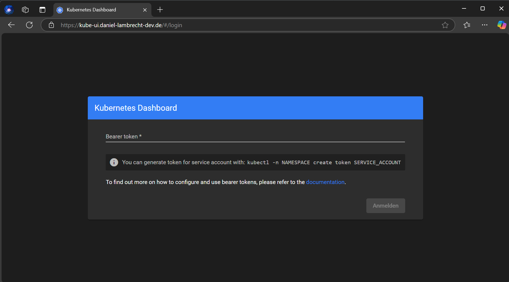
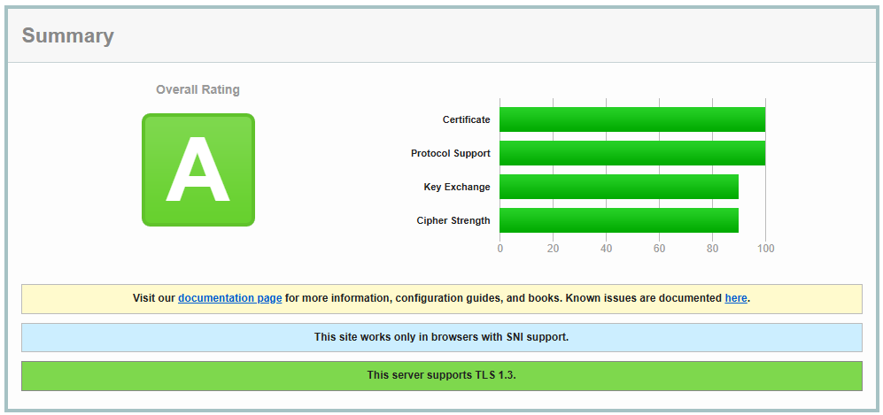

# Guide: Setting Up a Kubernetes Cluster with K3s, Traefik, cert-manager & Kubernetes Dashboard 

## 📚 Table of Content

- [Introduction](#introduction)
- [K3s Installation](#k3s-install)
  - [Requirements](#requirements)
  - [Installation of the Cluster](#installation)
  - [Kubeconfig](#kubeconfig)
- [Kubernetes Dashboard](#demo)
  - [cert-manager](#demo)
  - [Let's Encrypt](#demo)
  - [Ingress-Controller (with Traefik)](#demo)
  - [Dashboard Access](#demo)
  - [Domain Security Status](#demo)
- [Set-Up Demo Nginx Application](#demo)
- [Summary / Conclusion](#demo)
- [References](#references)


## introduction
In This guide/blog i Will show you how i set up my own kubernetes cluster & dashboard using k3s, Traefik and cert-manager.

In [THIS](https://github.com/d4niee/cluster-services) repo you can also see how you can manage and automate the cluster processes like deployment, update, deleting ressources and more.

first let's start with the used technologies for the cluster:

- **k3s** [1]:
  K3s is a fully compliant Kubernetes distribution with the following enhancements:

  - Distributed as a single binary or minimal container image.
  - Lightweight datastore based on sqlite3 as the default storage backend. etcd3, MySQL, and Postgres are also available.
  - Wrapped in simple launcher that handles a lot of the complexity of TLS and options.
  - Secure by default with reasonable defaults for lightweight environments.
  - Operation of all Kubernetes control plane components is encapsulated in a single binary and process, allowing K3s to automate and manage complex cluster operations like distributing certificates.
  - External dependencies have been minimized; the only requirements are a modern kernel and cgroup mounts.
  - Packages the required dependencies for easy "batteries-included" cluster creation:
    - containerd / cri-dockerd container runtime (CRI)
    - Flannel Container Network Interface (CNI)
    - CoreDNS Cluster DNS
    - Traefik Ingress controller
    - ServiceLB Load-Balancer controller
    - Kube-router Network Policy controller
    - Local-path-provisioner Persistent Volume controller
    - Spegel distributed container image registry mirror
    - Host utilities (iptables, socat, etc)

- **helm**: todo
- **traefik**: todo
- **cert-manager**: todo
- **kubernetes-dashboard**: todo

## k3s install

In this chapter i will show you how you can install the k3s cluster on your maschine. It does not matter if it's a VPS, raspberry pi or VM. You just need to be sure that you have a exposed domain mapped to your IP for your maschine to continue with this tutorial (for example demo.mydomain.com). In My case i set up da VPS with  [contabo.com](https://contabo.com/de/)

### Requirements

before we start follow the Requirements guide from k3s to be sure no issues will appear later. if you are using a ubuntu maschine like me you can allow following ports from your firewall:

```bash
sudo ufw allow 6443/tcp
sudo ufw allow from 10.42.0.0/16 to any
sudo ufw allow from 10.43.0.0/16 to any
```

also be sure that you maschine has at least 4G of RAM, 2 Cores and
enough disk space, but k3s don't need much disk space.

### installation

install the k3s cluster with following command:

```
curl -sfL https://get.k3s.io | sh -
```

thats it! that's all we have to do. Not really because we need the Kubeconfig to access our cluster but it's currently running and ready.

### Kubeconfig

You can find the Kubeconfig under the path ``/etc/rancher/k3s/k3s.yaml`` you can view it with the following command:

```bash
cat /etc/rancher/k3s/k3s.yaml
```

you should now see something like that:

```
apiVersion: v1
clusters:
- cluster:
    certificate-authority-data: 
    LS0tL ...
    ...
...
```

### set up kubeconfig on windows

be sure to save this kubeconfig to your local maschine or whatever maschine you want to access the cluster. I will show you how to do that. First if you are using Windows you need to install kubectl [here](https://kubernetes.io/docs/tasks/tools/install-kubectl-windows/)

after that you are able to use the kubectl command in the terminal to manage your cluster. But at this point we are only able to manage o local installed cluster like minkube. In order to access the VPS Cluster you need to create a file named ``config`` in the folder ``C:\Users\<user>\.kube`` and paste the content from the k3s.yaml file. Thats all you just need to make sure to change the following line:

```
server: https://127.0.0.1:6443
```

to your VPS Global IP adress. 

now you can test the connection for example with ``kubectl get nodes`` and should see following output:
```
$ kubectl get nodes
NAME        STATUS   ROLES                  AGE     VERSION
vmd164557   Ready    control-plane,master   6d15h   v1.31.6+k3s1
```

### set up kubeconfig on Linux

Download the latest version of kubectl

```
curl -LO "https://dl.k8s.io/release/$(curl -s https://dl.k8s.io/release/stable.txt)/bin/linux/amd64/kubectl"
```

make sure to make it executable

```
chmod +x kubectl
```

To verify the installation:
```
kubectl version --client
```

now copy the value from the k3s.yaml to your local linux machine
```
mkdir -p ~/.kube
sudo cp /etc/rancher/k3s/k3s.yaml ~/.kube/config
sudo chown $(id -u):$(id -g) ~/.kube/config
```

also here test the connection with:
```
$ kubectl get nodes
NAME        STATUS   ROLES                  AGE     VERSION
vmd164557   Ready    control-plane,master   6d15h   v1.31.6+k3s1
```

## Install Helm

The last thing to to in order to fully manage our cluster is to install Helm. it is optionally but i would highly recommned to use Helm for managing cluster services.

You can install Helm on Linux/Ubunto with this command:
```
curl -fsSL -o get_helm.sh https://raw.githubusercontent.com/helm/helm/main/scripts/get-helm-3
chmod 700 get_helm.sh
./get_helm.sh
```

and on windows with choco what i would recommend. if you don't have choco installed you can install it [here](https://chocolatey.org/install)
```
choco install kubernetes-helm
```

And Thats it. we have now everything we need in order to install the Dashboard to our cluster and install cluster-services onto it.

## Kubernetes Dashboard

### cert-manager

```
helm repo add jetstack https://charts.jetstack.io --force-update
```

```
helm install \
  cert-manager jetstack/cert-manager \
  --namespace cert-manager \
  --create-namespace \
  --version v1.17.0 \
  --set crds.enabled=true
```

verify:
```
kubectl -n cert-manager get pod
```

### certifacte management with Let's Encrypt

```
helm create cert-manager-config
```

remove everything from the ``templates`` folder and add following manifests instead:

ci-production.yaml:
```yaml
apiVersion: cert-manager.io/v1
kind: ClusterIssuer
metadata:
  name: {{ .Values.clusterIssuers.production.name }}
  namespace: default
spec:
  acme:
    server: {{ .Values.clusterIssuers.production.server }}
    email: {{ .Values.clusterIssuers.email }}
    privateKeySecretRef:
      name: {{ .Values.clusterIssuers.production.secretName }}
    solvers:
      - selector: {}
        http01:
          ingress:
            class: {{ .Values.clusterIssuers.ingressClass }}

```

ci-staging.yaml:
```yaml
apiVersion: cert-manager.io/v1
kind: ClusterIssuer
metadata:
  name: {{ .Values.clusterIssuers.staging.name }}
  namespace: default
spec:
  acme:
    server: {{ .Values.clusterIssuers.staging.server }}
    email: {{ .Values.clusterIssuers.email }}
    privateKeySecretRef:
      name: {{ .Values.clusterIssuers.staging.secretName }}
    solvers:
      - selector: {}
        http01:
          ingress:
            class: {{ .Values.clusterIssuers.ingressClass }}

```

and paste the following values to the values.yaml manifest:

values.yaml:
```yaml
clusterIssuers:
  email: YOUR EMAIL
  ingressClass: traefik

  production:
    name: letsencrypt-production
    server: https://acme-v02.api.letsencrypt.org/directory
    secretName: letsencrypt-production

  staging:
    name: letsencrypt-staging
    server: https://acme-staging-v02.api.letsencrypt.org/directory
    secretName: letsencrypt-staging
```

verify the installation:
```bash
kubectl get ClusterIssuer -A

kubectl describe clusterissuer letsencrypt-staging
kubectl describe clusterissuer letsencrypt-production
```

### traefik

```bash
helm create ingress-controller
```

remove everything from the ``templates`` folder and add following manifests instead:

hcc-ingress.yaml
```yaml
apiVersion: helm.cattle.io/v1
kind: HelmChartConfig
metadata:
  name: traefik
  namespace: kube-system
spec:
  valuesContent: |-
    globalArguments:
      - "--serversTransport.insecureSkipVerify=true"
    additionalArguments:
      - "--api"
      - "--api.dashboard=false"
      - "--api.insecure=false"
      - "--log.level=ERROR"
    ports:
      websecure:
        tls:
          enabled: true
      web:
        redirectTo:
          port: websecure
```

ingress.yaml
```yaml
apiVersion: networking.k8s.io/v1
kind: Ingress
metadata:
  name: traefik-ingress
  namespace: kube-system
  annotations:
    spec.ingressClassName: traefik
    traefik.frontend.rule.type: PathPrefixStrip
    cert-manager.io/cluster-issuer: {{ .Values.traefik.ingress.clusterIssuer }}
spec:
  rules:
    - host: {{ .Values.traefik.ingress.host }}
      http:
        paths:
          - path: /
            pathType: Prefix
            backend:
              service:
                name: {{ .Values.traefik.dashboard.service.name }}
                port:
                  number: {{ .Values.traefik.dashboard.service.port }}
  tls:
    - hosts:
        - {{ .Values.traefik.ingress.host }}
      secretName: {{ .Values.traefik.ingress.tlsSecretName }}
```

service-traefik.yaml
```yaml
apiVersion: v1
kind: Service
metadata:
  name: {{ .Values.traefik.dashboard.service.name }}
  namespace: kube-system
  labels:
    app.kubernetes.io/instance: {{ .Values.traefik.dashboard.service.selector.instance }}
    app.kubernetes.io/name: {{ .Values.traefik.dashboard.service.selector.name }}-dashboard
spec:
  type: ClusterIP
  ports:
    - name: traefik
      port: {{ .Values.traefik.dashboard.service.port }}
      targetPort: {{ .Values.traefik.dashboard.service.targetPort }}
      protocol: TCP
  selector:
    app.kubernetes.io/instance: {{ .Values.traefik.dashboard.service.selector.instance }}
    app.kubernetes.io/name: {{ .Values.traefik.dashboard.service.selector.name }}

```

values.yaml
```yaml
traefik:
  globalArguments:
    - "--serversTransport.insecureSkipVerify=true"
  additionalArguments:
    - "--api"
    - "--api.dashboard=false" # add here true if you want to access a traefik dashboard
    - "--api.insecure=false"
    - "--log.level=ERROR"
  ports:
    websecure:
      tls:
        enabled: true
    web:
      redirectTo:
        port: websecure
  ingress:
    enabled: true
    host: yourdomain.example.com
    tlsSecretName: traefik-daniel-lambrecht-dev-tls
    clusterIssuer: letsencrypt-production
  dashboard:
    service:
      name: traefik-dashboard
      port: 9000
      targetPort: traefik
      selector:
        instance: traefik-kube-system
        name: traefik
```

### demo nginx application

```bash
helm create nginx
```

values.yaml
```yaml
application:
  name: application
  image:
    repository: nginx
    tag: latest
  containerPort: 80

service:
  type: ClusterIP
  port: 80
  targetPort: 80

ingress:
  enabled: true
  host: yourdomain.example.de
  path: /
  pathType: Prefix
  tls:
    enabled: true
    secretName: landingpage-daniel-lambrecht-dev-tls
  annotations:
    ingressClassName: traefik
    certManagerClusterIssuer: letsencrypt-production

certificate:
  name: landingpage-cert
  secretName: landingpage-daniel-lambrecht-dev-tls
  issuerRef:
    name: letsencrypt-production
    kind: ClusterIssuer
  commonName: yourdomain.example.de
  dnsNames:
    - yourdomain.example.de

```

```

```


### dashboard



### Domain Security Status



### persistent admin key (optional)

## How to manage cluster services?

If you wonder how you can manage cluster services i can tell you there a many ways to do it. And I'm sure people find better solutions than me. But if you wan't to view how I manage my cluster services you can check out my cluster-services Repository [Here](https://github.com/d4niee/cluster-services). In this Repo you can learn:
- how to structure a cluster-services repository
- writing pipelines to:
  - automate the cluster deployments
  - linting helm charts
  - recovery

If you are interested take a look and inspiration.

## references

[1] Official k3s Documentation: https://docs.k3s.io/